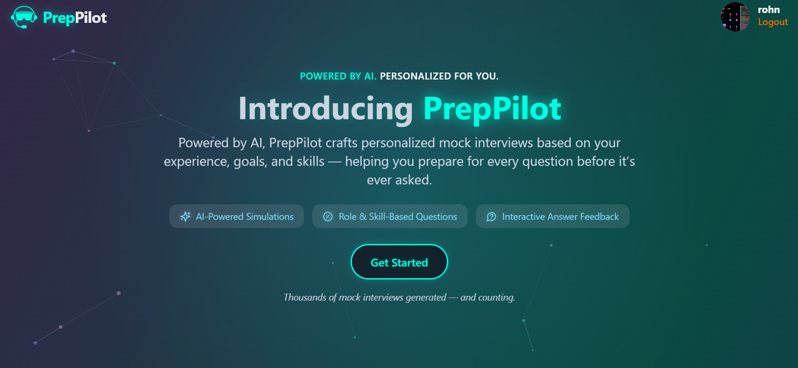
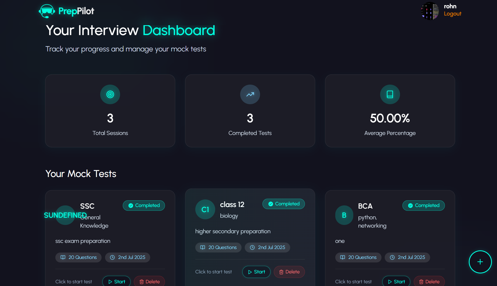
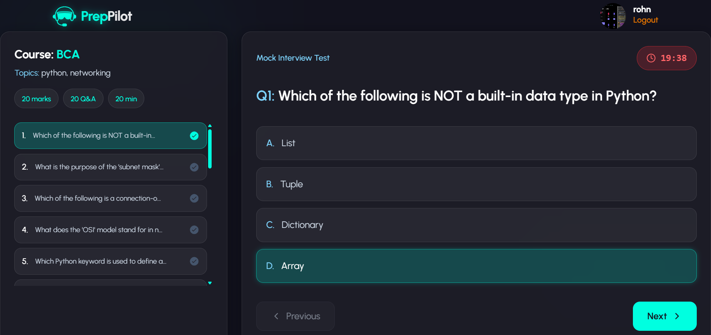

# PrepPilot - AI-Powered Interview Preparation Platform

A comprehensive React-based web application that provides AI-powered interview preparation through personalized mock tests and interactive learning sessions.


*Modern glassmorphism design with AI-powered interview preparation*

## 🚀 Features

### Core Functionality
- **AI-Powered Mock Tests**: Course-oriented mock interviews with timer functionality
- **Interactive Interview Sessions**: Role-specific Q&A with AI-generated questions
- **Real-time Progress Tracking**: Performance analytics and detailed results
- **Personalized Learning**: Adaptive content based on user experience and goals

### User Experience
- **Modern UI/UX**: Glassmorphism design with smooth animations
- **Responsive Design**: Optimized for desktop and mobile devices
- **Dark Theme**: Professional dark mode interface
- **Interactive Elements**: Hover effects, transitions, and micro-interactions

### Advanced Features
- **Smart Timer System**: Automatic submission and time tracking
- **Progress Analytics**: Detailed performance metrics and insights
- **Session Management**: Create, edit, and delete interview sessions
- **Results Dashboard**: Comprehensive test results with explanations

## 🛠️ Tech Stack

### Frontend Framework
- **React 18** - Modern React with hooks and context
- **Vite** - Fast build tool and development server
- **React Router** - Client-side routing and navigation

### Styling & UI
- **Tailwind CSS** - Utility-first CSS framework
- **Framer Motion** - Animation library for React
- **Lucide Icons** - Modern icon library
- **Custom CSS** - Gradient animations and glassmorphism effects


## 🎯 Key Pages & Features

### 🏠 Landing Page
- Hero section with animated gradients
- Feature showcase with glassmorphism cards
- User testimonials and FAQ section
- Authentication modal integration
- Responsive design with mobile optimization


*Clean and intuitive dashboard interface*

### 📊 Dashboard
- **AI Learning Dashboard**: Interview session management
- **Mock Test Dashboard**: Course-based test creation and tracking
- Statistics cards with performance metrics
- Session grid with filtering and actions
- Real-time progress tracking

### 📝 Mock Test System
- Timer-based quiz interface with auto-submission
- Question navigation and progress tracking
- Real-time answer selection and validation
- Detailed results with explanations and correct answers
- Performance analytics with visual charts


*Interactive mock test interface with timer*

### 🎤 Interview Preparation
- AI-generated questions based on role and experience
- Interactive Q&A with expandable answers
- Concept explanations and learning resources
- Progress tracking and session management
- Difficulty level adaptation

## 🔧 Installation & Setup

### Prerequisites
- **Node.js 16+** 
- **npm** or **yarn**
- **Git** for version control

### Installation Steps

1. **Clone the repository**
```bash
git clone <repository-url>
cd newTest/frontend
```

2. **Install dependencies**
```bash
npm install
# or
yarn install
```

3. **Environment Setup**
```bash
# Create .env file with required variables
cp .env.example .env

# Add your environment variables
VITE_API_BASE_URL=your_backend_url
```

4. **Start development server**
```bash
npm run dev
# or
yarn dev
```

5. **Build for production**
```bash
npm run build
# or
yarn build
```

6. **Preview production build**
```bash
npm run preview
# or
yarn preview
```

## 📱 Available Scripts

- `npm run dev` - Start development server (port 3000)


## 📱 Responsive Design


## 📄 License

This project is licensed under the MIT License - see the [LICENSE](LICENSE) file for details.


## 🌟 Acknowledgments

- **React Team**: For the amazing framework
- **Tailwind CSS**: For the utility-first CSS framework
- **Lucide Icons**: For beautiful icons
- **Vite Team**: For the fast build tool
- **Open Source Community**: For inspiration and contributions

---

*Built with ❤️ using React and modern web technologies*


*Empowering careers through AI-powered interview preparation*